# Bean Nuts Hazelnut Hydra <br> 九头龙，分布式操作系统
<p align="center">
  <strong>
  真超级个体, 一个人公司, 一个集团, 一个人中台, 大规模AI、数据、任务调度工业架构, 大规模控制, 
  中央情报系统, 大规模分布式爬虫, 大数据处理, 数据仓库, 云计算, 中台
   </strong>
</p>

<p align="center">
  <a href="https://docs.nutsky.com/docs/hazelnut_sauron_zh_cn">
    
  </a>

   <a href="https://github.com/DragonKingpin/Hydra/blob/beta/CHANGELOG.md" >
    
  </a>

   <a target="_blank" href="https://www.oracle.com/technetwork/java/javase/downloads/index.html" >
        
    </a>
   <a target="_blank" href='https://github.com/DragonKingpin/Hydra'>
        
   </a>

   <a target="_blank" href=''>
        
   </a>
</p>

<p align='center'>
  <b>简体中文</b> | <b>English[TODO]</b> | <a href="https://www.nutsky.com">Nuts Projects</a> | 
  <a href="https://www.dragonking.cn" target="_blank">Dragon King</a> | <a href="https://www.wkwja.cn" target="_blank">Ken 老板</a> 
  | <a href="https://www.geniusay.com" target="_blank">Genius 老板</a> | <a href="https://www.welsir.com" target="_blank">Welsir 老板</a> 
</p>

<p align='center'>
  文档（持续增量更新）:
  <a href="https://docs.nutsky.com/docs/hazelnut_sauron_zh_cn" target="_blank">https://docs.nutsky.com/docs/hazelnut_sauron_zh_cn</a> |
  真实集群搭建过程:
    <a href="https://zhuanlan.zhihu.com/p/634851956" target="_blank">https://zhuanlan.zhihu.com/p/634851956</a>
</p>

## 📖 Abstract
Would you like to own the "God Eyes"? Do you crave power? Do you wish to wield all information at your fingertips? 
**Now, data is all you need!**

The Hazelnut and Hydra ecosystem is a powerful data analysis "Elder Brain" designed specifically for "TJ" individuals, 'all information all I need'.
**Hey, commander!** We build a unique personal PB level data warehouse, knowledge base, and search engine just for you, your exclusive "God Eyes" !

Your own C4ISR, your own 'global' strike system, Central Intelligence System, Central Staff System, and firepower industrial plants. 
The underlying architecture of above.

## 📖 摘要 / 简介
**你想拥有‘上帝之眼’吗？你渴望力量吗？你希望一切信息尽在掌控吗？这个时代，数据即使世界！**

Hydra 生态，专为"TJ"人打造的大规模数据分析“主脑”，一切尽在掌握之中。
Hydra为你打造个人PB级数仓、知识库、图库、任务编排和服务于 Agent 工厂化的超级个体引擎，你的专属'上帝之眼'，为所欲为！

到底这是什么玩意？属于你自己的C4ISR，你自己的“全球”打击系统、中央情报系统、中央参谋系统和火力军工厂的底层战略架构。

### 字多不看？太高端听不懂？几个场景助你快速了解Hydra理念。
- **大规模知识库**：构造你的私人知识库，关联任何你感兴趣的知识图谱（金融、新闻、学术、游戏、音乐、电影、视频、小说、美食等），生成巨型知识库和图谱，并交给GPT等大模型给你生成属于你的`上帝报告`。
- **数据仓库**：海量数据，任你处置，你可以打造自己的数据`全图挂`，甚至可以乘坐时光机，在数据世界中随意穿行。你就是上帝，历史的变迁，触手可及。
- **数据集市**：打造你的个人GPT，随着算力平民化、大模型技术的平民化。未来，你不想拥有自己的GPT吗？你只需要不断收集属于你的数据集，未来打造你的专属GPT、Diffusion等。
- **大型采集**：统一并行架构打造大规模战略采集系统，多个实例助你快速入门：
1).维基百科全站爬取；2).Urban Dictionary全站爬取；3).imdb爬取；4).编年史子项目，每日全世界新闻采集，打造互联网记忆库与情报系统；
5).金融数据大规模采集（面向资金流向建模）；6).IP反查、ISP追踪、DNS/rDNS、域名、NIC等搜索引擎基架数据采集；等。（避免争议，不提供任何有争议的代码和数据）
- **数据平台**：面向战略和战术数据分析系统，构建和打通其他开源数据产品，面向智能ETL、数仓、取数、情报等专业大数据分析系统。
- **中台架构**：面向系统性实现上层应用、面向抽象、统一化，支撑大规模并行、大数据架构，信息、控制、调度、审计、权限等元架构分离。

### 🏆 3A史诗巨献
全域覆盖、听你指挥、能打胜战、作风优良。

### 什么是 Hydra，他能干嘛？
- Hydra 由 <a href="https://www.dragonking.cn" target="_blank">DragonKing</a> 及其团队原创的分布式基架系统，
面向系统性构建上层大型应用。Hydra的设计基础首先是面向控制的，用于实现大规模控制，进而实现通用任务、服务操作系统。
与其他操作系统设计理念类似，倡导内核做事、统筹规划。
- 其设计根源是基于对中台架构的创新和一体化，并尝试构造更一致的内核，
目前的设计尝试由一个迷你中台和云系统（<a href="https://www.nutsky.com">豆子坚果云</a>）不断自底向上迭代。
- Hydra基架如下图所示，自顶向下整体分为三层：应用（具体）、中级（典型）、底层（抽象）。对应图中应用层、中级应用中台、中台层。
- 一个操作系统至少需要实现对任务、服务、资源、存储、消息、信号、权限等子系统的控制和管理。
Hydra也是如此，但是由于时间和性价比问题，资源管理内核由具体的第三方系统代理（如Yarn）。

#### 全局架构鸟瞰图
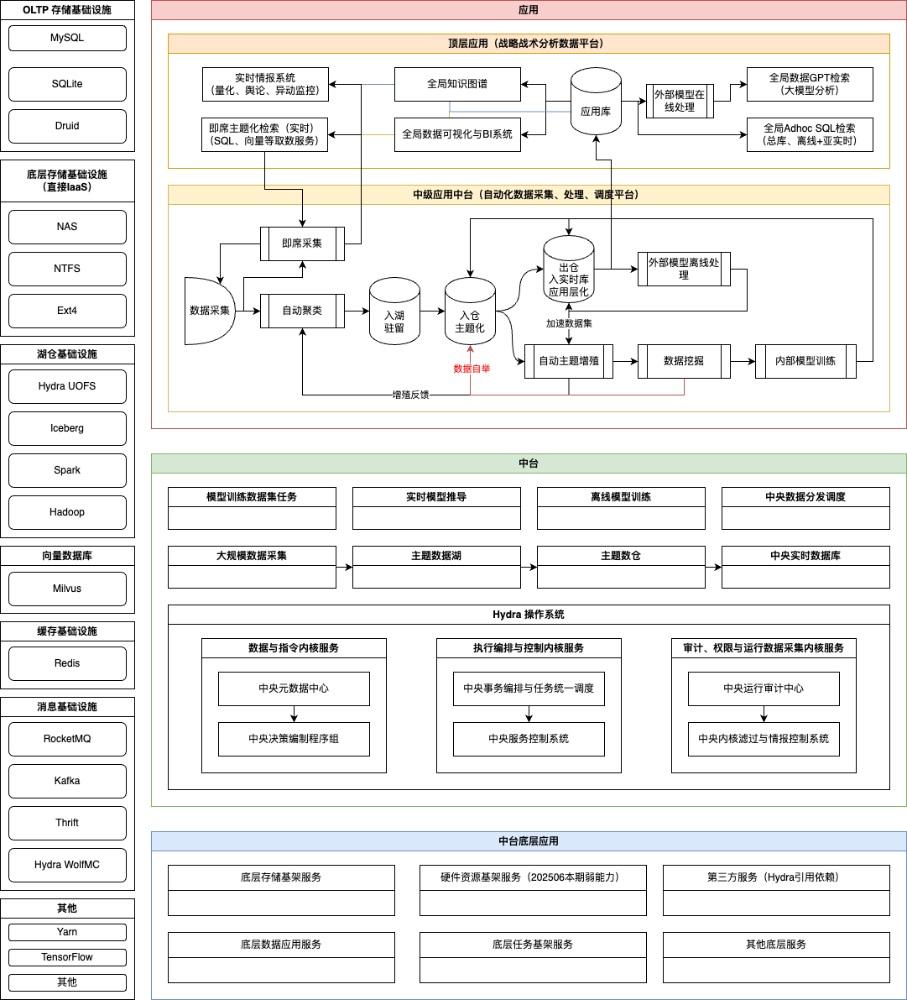

01. 支持统一高度抽象化的任务、事务、服务等编排，一套接口，可分级、可本地、可集群。
02. 抽象统一分布式资源树系统，场景树、服务树、任务树、部署树、配置树、存储树等。
03. 可多级、可嵌套的编排系统，支持配置域管理、复杂配置动态解耦、可继承和重写的多域配置管理。
04. 可事务化抽象进程、线程模型，让远端服务通过RPC或通信组件通过一套接口，像本地进程一样进行统一管理。
05. 可事务图化编排方法论设计，就像TensorFlow，更抽象简单的服务、任务设计模式。事务和任务编排支持序列和并行两种模式，更支持性能模式。确保事务绝对执行、回滚、性能执行、并行等多种范式。
06. 面向统一解释器模式方法论和过程化设计，事务和任务编排逻辑化，支持循环控制、条件控制、散转控制、原子化等。
07. 抽象统一任务管理器体系，统一生命周期设计，多类任务一套“任务管理器”，就像本地系统一样简单。
08. 抽象统一系统架构体系，可中心化、可联邦化、可链式化，一切皆有可能。
09. 抽象统一外部文件系统，基于Common VFS 统一文件系统管理，从复杂底层存储中解放。
10. 抽象统一内核文件系统，支持级联逻辑卷（简单卷、跨区卷、条带卷）可自由容量编排规划，分布式对象文件系统，支持多种文件系统操作。
11. 抽象统一数据处理体系，泛容器化思想，抽象化DAO、DTO、Data Manipulation架构，一切皆可是Map、List、Set和Table等。
12. 抽象化部署模式和抽象云部署，无论是任何系统、本地进程、虚拟机部署、容器部署等。Hydra为您统一，“小程序”化进程模型，就像Springboot一样简单。
13. 基于分治和MapReduce思想设计，面向大数据处理处理系统设计。
14. 双工多路RPC设计基于Netty和NIO，支持双向控制（服务端可被动控制客户端），双端可收发，支持JSON、BSON、Protobuf（Java全自动动态编译）。
15. 传统实例化、IOC化、C/C++风格化，多种对象生命周期模式，更有趣的系统设计。
16. 可分级、分组、嵌套、级联的设计方法论，确保更灵活的大型系统设计，确保系统结构清晰、规整、可视、整整齐齐。
17. 无需担心抽象，无需担心"吹牛逼"，我们尽可能通过实际案例和有效代码，展示系统功能，也欢迎commit。——以实现小型爬虫搜索引擎为例。


### 子系统、框架和实例系统
#### Bean Nuts Hazelnut Sauron Radium (索伦·镭，分布式爬虫引擎)
- 该部分为分布式爬虫引擎、爬虫大数据处理、清洗、持久化框架系统的实现。面向分布式大规模系统性爬虫设计，支持任务编排和并行流水线爬虫、支持周期和定时大规模爬虫、支持并行离线数据处理。
#### Bean Nuts Hazelnut Sauron Shadow (索伦·暗影，以爬虫、小型搜索引擎为例)
- 该部分基于Pinecone、Ulfhedinn、Slime、Hydra、Radium等子框架最终设计的搜索引擎（数据采集、数据处理侧）应用实例。
- 多个实例助你快速入门：1).维基百科全站爬取；2).Urban Dictionary全站爬取；3).imdb爬取；4).编年史子项目，每日全世界新闻采集，打造你的互联网记忆库；等。
#### Bean Nuts Hazelnut Sauron Eyes - The God View (索伦·之眼，数据知识图谱化与检索系统[用户侧终端应用])
- 数据检索引擎演示实例参考SauronEyes (https://god.nutsky.com | http://www.godview.net)


## ⚔ 目录
* [一、描述](#一描述)
    * [1.1、框架组成](#11框架组成)
        * [1.1.1、Pinecone 基础运行支持库](#111基础运行支持库)
             * [1.1.1.1、扩展容器](#1111扩展容器)
             * [1.1.1.2、工具库](#1112工具库)
        * [1.1.2、Slime 大数据系统支持框架](#112大数据系统支持框架)
        * [1.1.3、Ulfhedinn 基础运行支持库，第三方依赖版](#113大数据系统支持库)
        * [1.1.4、Hydra 分布式、任务系统框架](#114分布式、任务系统框架)
        * [1.1.5、Radium 分布式爬虫系统框架](#114分布式、任务系统框架)
    * [1.2、功能模块组成](#12功能模块组成)
        * [1.2.1、网络通信库](#121网络通信库)
            * [1.2.1.1、流处理模块](#1211流处理模块)


* [二、编译、使用](#二编译、使用)
* [三、目录结构说明](#三目录结构说明)
    * [3.1、TODO](#31TODO)

* [四、使用许可](#四使用许可)
* [五、参考文献](#五参考文献)
* [六、致谢](#六致谢)
* [七、题外话](#七题外话)

## 一、📝 描述
### 1.1、框架组成
#### 全局中央架构鸟瞰图（抽象全局架构）
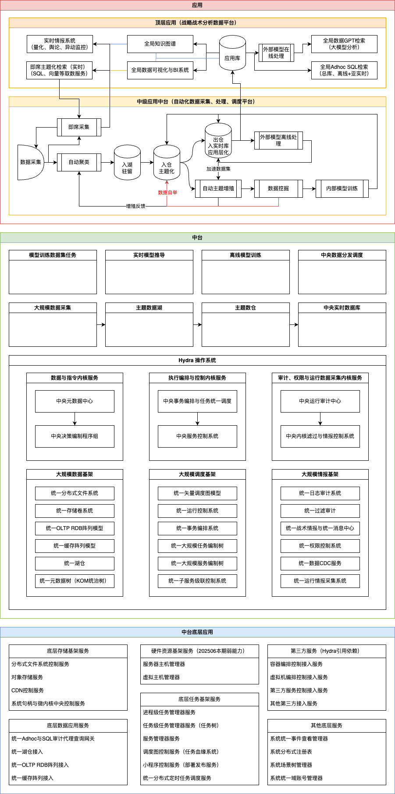
#### 1.1.1、Pinecone 基础运行支持库
##### 1.1.1.1、 扩展容器
1. LinkedTreeMap
2. ScopeMap (多域查找树、Map), 实现和支持类似动态语言（如JS、PHP、Python等）的底层继承数据结构，支持两类子模型（单继承、多继承），
可以实现多域查找的功能。
3.  Dictium、Dictionary（字典接口模型），实现和支持类似动态语言（如PHP、Python等）的Array、字典查找，Map和可索引对象进一步抽象化。
4.  Multi*Map (多种MultiValueMap范式)，实现支持多种多值Map的实现，如MultiCollectionMap、MultiSetMap等。
5.  Top (TopN问题通用解决)，实现和支持堆法、有序树法、多值有序树法三种实现。
6.  distinct (差异器)，实现传统Set法、分治法、Bloom等的集合差异分析器。
7.  affinity (亲缘性器)，实现和支持对亲缘抽象字典的继承、重写等。
8.  tabulate (遍历器)，实现以列表式对抽象字典的内部递归，并列表化和分析亲缘关系。
9.  ShardList (非复制式共享数组)，由 @Geniusay 贡献。
10. TrieMap (前缀树Map)，支持非递归迭代器，类文件系统完整功能前缀树，Symbolic Reparse 引用挂载点。
##### 1.1.1.2、工具库
1. JSON库，BSON，JPlus(JSON++)库 (面向可二次开发、设计的自由JSON设计)，可以重写JSONEncoder、JSONDecoder、JSONCompiler、JSONDecompiler、注入器等。
2. Name命名空间库
3. lang (Java包和扩展库)，支持各类类扫描方法、包扫描方法、遍历和收集方法、加载、多域扫描等。
4. GUID (由@kenssa4eedfd贡献)，统一分布式ID，魔改百度Uid，GUID64、GUID72，支持随机混淆。
4. TODO
TODO
#### 1.1.2、Hydra 
##### 1.1.2.1、系统架构、骨架设计
1. HierarchySystem，阶级系统(Master-Slaver推广架构)
2. FederalSystem，联邦系统(面向投票式设计) [BETA, 20250101]
3. BlockSystem，块式系统(面向边缘、链式系统设计)。让你的每台设备都成为你专属链上节点。 [BETA, 20250101]
4. CascadeComponent, 级联组件设计，支持亲缘性回收控制，“The Omega Device”，级联回收主键引用。
5. 分布式容器（分布式多域树等）
6. 分布式微内核\
   借鉴WinNT、Unix，支持KernelObject、挂载点、统一内核对象管理。\
   Unix风格内核句柄路径化，如分布式挂载 /proc/、/dev/ 等。 
##### 1.1.2.2、统一调度编排系统
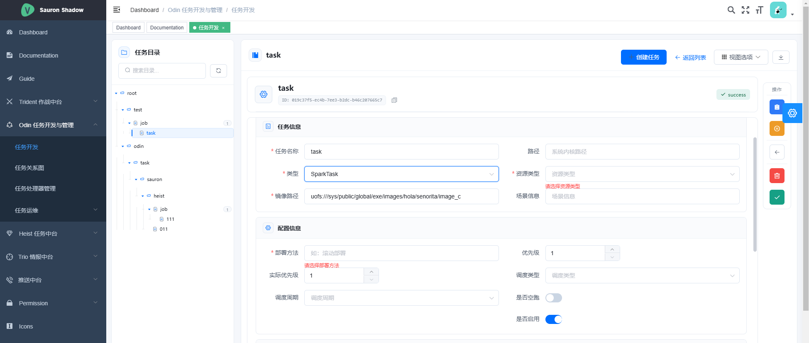
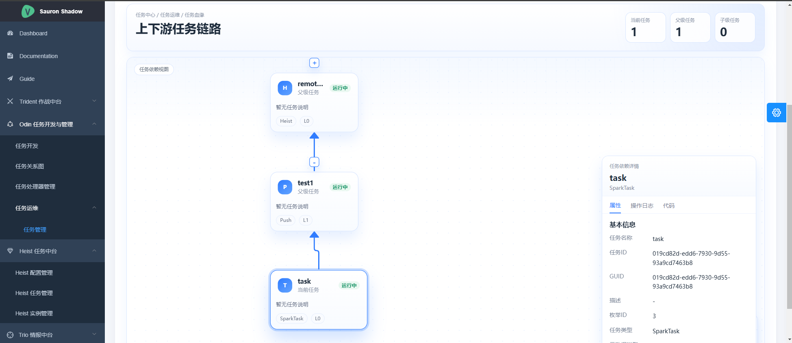
1. Orchestration (事务、任务编排子系统)，面向统一解释器模式方法论和过程化设计，事务和任务编排逻辑化，支持循环控制、条件控制、散转控制、原子化等，更支持事务完整性设计。
2. Auto (简易命令模式，可编程自动机系统)，实现支持Automaton简易生产-消费命令队列，实现支持PeriodicAutomaton可编程Timer，实现支持Marshalling流水线指令编排器。(更多Timer和算法持续更新中)
3. Vector DAG（矢量图），
本文提出一种通用的大规模矢量DAG（Vector DAG）图模型，用于支撑高性能调度、编排与控制任务，适配亿级以上节点规模的实际应用场景。通过拓扑拆分、矢量化子图划分及多种并发图算法，实现了大规模调度控制能力。
算法支持关键路径计算、节点可达性判断、剪枝优化、最小生成子图合并及最短路径计算等核心图处理能力。
https://docs.nutsky.com/docs/hazelnut_sauron_zh_cn/uniform_massive_graph_dispatch
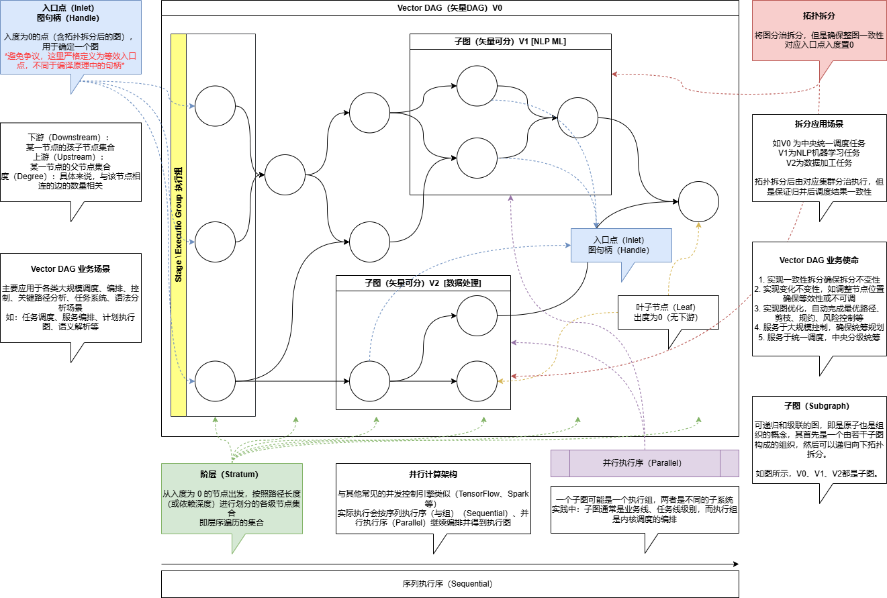

##### 1.1.2.3、小程序系统
Servgram，小程序系统，是的这很微信，不过是服务端的小程序哦！进一步抽象和推广进程思想，任何服务介质（本地、虚拟机、容器等），一切服务、一切任务等。
一切统一和谐，一套调度、一套接口、一套操作，生命周期整整齐齐（满足你的控制欲），更可冗余确保稳定。\
配合任务编排和事务编排，多个任务，一套系统全包干。
(TODO，远端进程进一步实现、实现统一分布式锁接口)
##### 1.1.2.4、统一消息分发系统
##### 1.1.2.5、WolfMC RPC
1. 基于Netty设计的原创消息控制中间件，支持RPC模式。
2. 支持JSON、BSON、Protobuf，更多RPC协议和数据结构持续更新中。[TODO 分片、泳道]
3. 支持双工通信，双端可收可发。（服务端可被动控制客户端，双路Channel池设计）
4. 全自动Protobuf动态编译，支持直接接口代理（类似Mybatis Mapper工厂）。
5. 支持异步回调，类似AJAX。
6. 支持同步回调。
7. 配合MessageExpress, 支持类似 Spring Controller 式消息控制。
8. 支持AOP、IOC，可以自动依赖注入，支持类似Controller范式和消息注解拦截。

##### 1.1.2.6、统一服务注册、发现、管理系统
1. 服务树\
支持多级分类的服务树，可以设置多级命名空间，如 `Name1.Name2.应用1.服务1`。\
支持元信息继承、多引用、节点回收、支持复杂服务管理分类。

##### 1.1.2.7、分布式微内核
1. 配置树、分布式注册表\
   "盗版" Apollo，支持分布式配置管理。一个配置中心，就像 Windows注册表一样。
   1. 统一DOM / 前缀树 抽象化，支持自定义节点（插件设计），文件系统式设计。
   2. 支持配置继承
   3. 支持Hard Link 引用(标记法引用计数，有循环引用检测 / inode 表设计)
   4. 支持选择器 （路径选择器、XPath）
   5. 支持大数据（数据库基准）
   6. 路径缓存设计
   7. 改进非递归DFS路径寻址算法
   8. 兼容Windows 配置表风格
   9. 支持移动、复制（支持递归级联，复制 / 移动文件夹和配置项）
   10. 支持 JSON、XML 等原始文本或动态数据格式，支持 JSON、XML 与注册表混转。
   11. 支持配置动态渲染（EL表达式、逻辑循环支持）
   12. 数据库操作和底层分离，支持数据库、内存、Redis等任意数据源
   
2. 任务树\
   任务、进程分类、分组和编排系统。\
   对一级挂载点 `/proc/${proc_guid}/task` 的二级挂载和分类。
3. 部署树、部署管理器\
   多种部署模式（如容器、虚拟机、PaaS等），分类、分组和编排系统，类似 Windows 设备管理器。\
   抽象部署设备类似传统操作系统的物理设备，通过编写驱动，实现对部署子系统的管理。
4. 场景树\
   功能分类、分组和编排系统。
5. 统一用户系统
   1. 内核级统一用户、凭证、角色、权限管理。
   2. 统一单点登录中台化设计。
   3. 支持域、组、用户三级设计。
   
##### 1.1.2.8、分布式存储系统
1. 卷系统
   1. 物理卷，多种数据源设计
   2. 简单卷
   3. 跨区卷
   4. 条带卷，基于状态机无锁编程化并行存储，采用基于差分多路缓存滑动窗口、DFA、FIFO多线程缓存等算法优化的高性能条带卷设计。

  应用层面本项目提供了物理卷与逻辑卷的管理后台方便用户的管理与使用
  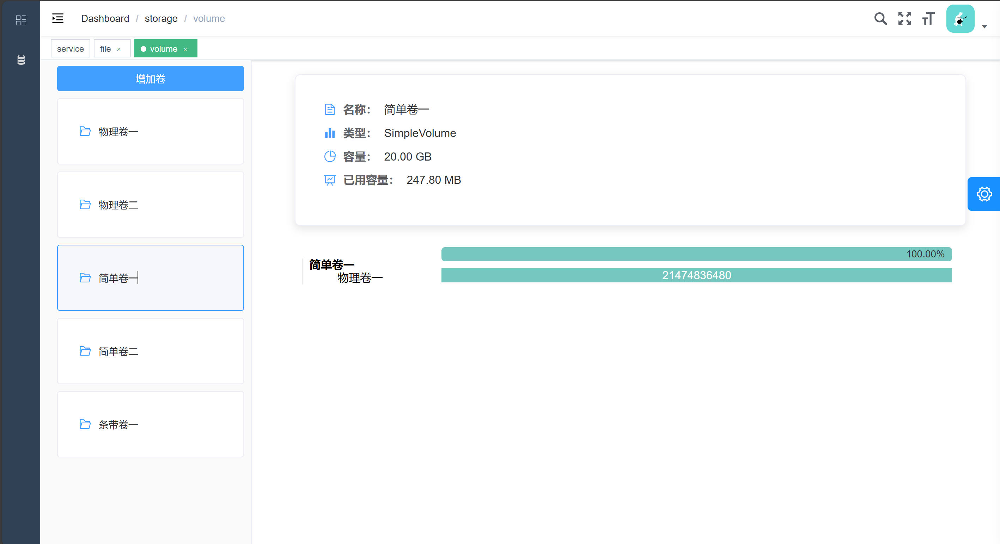
  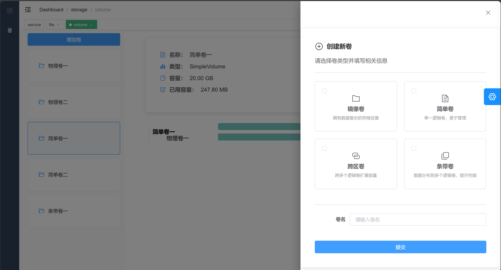
  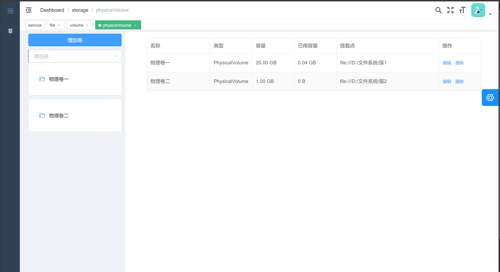

2. 分布式文件系统\
Hydra 是基于多级级联的大型系统架构，UOFS同样沿用了Hydra的整体架构体系，采样全局级联的设计。支持存储节点、索引节点、卷节点等每一层级的级联设计。

应用层面本项目不仅提供了文件浏览器的核心功能，还支持文件预览、多集群上传、外部挂载、文件完整性验证等。
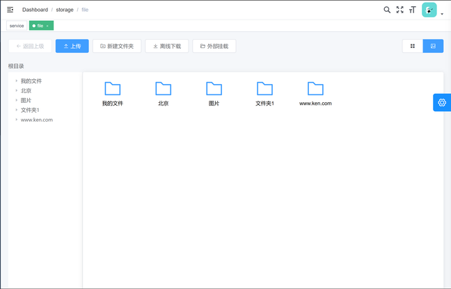
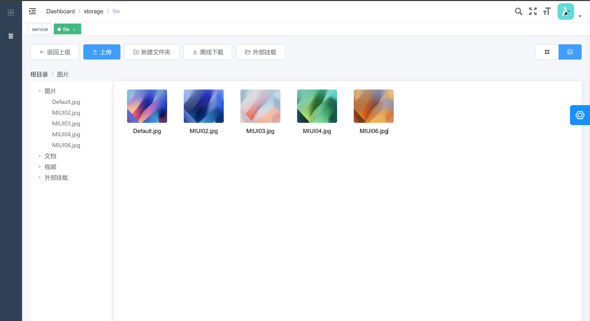
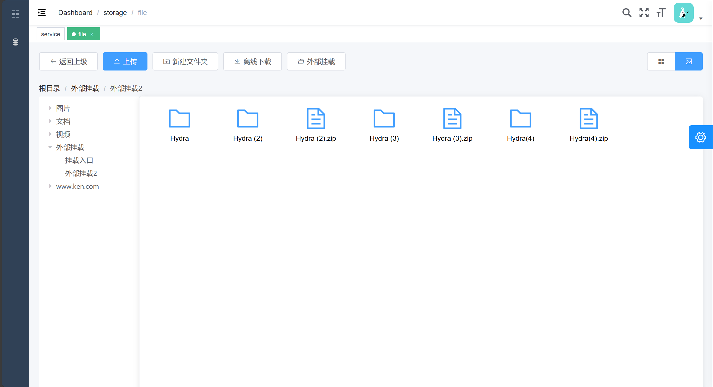
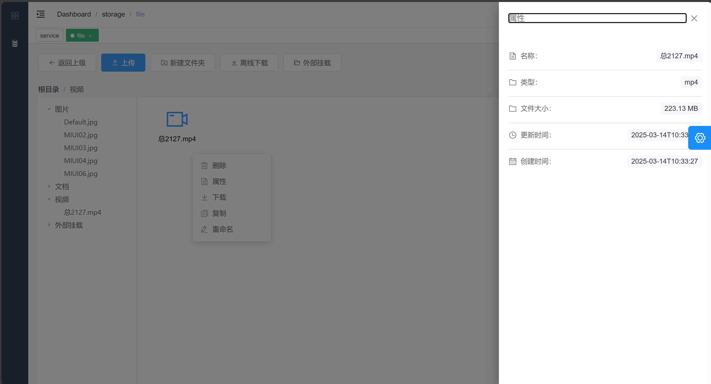

3.基于UOFS的CDN(文件分发网络)
本项目基于UOFS结合Kafka、RocketMQ、服务管理中心等提供了保证数据一致性的CDN服务,并提供文件版本管理与站点管理。
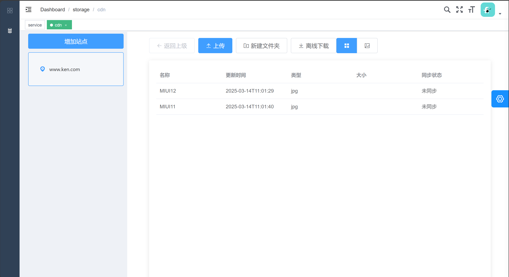
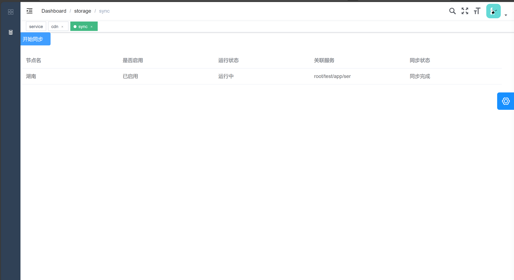
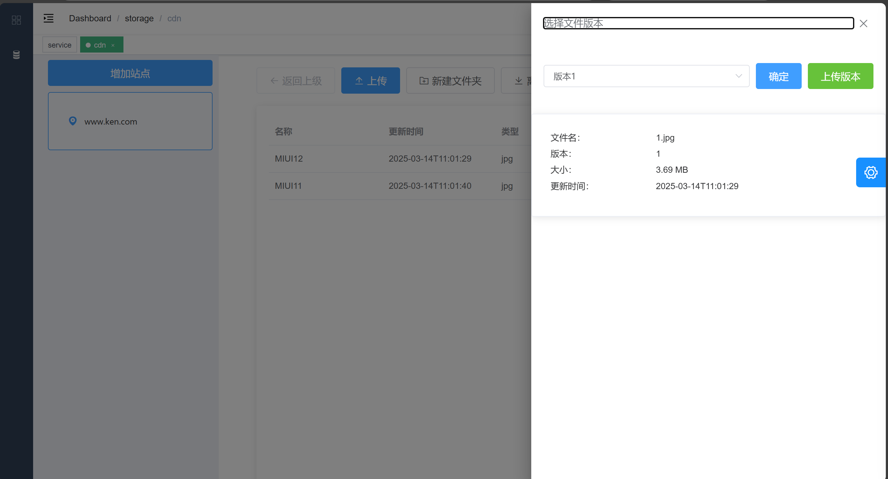


4. 版本管理

##### 1.1.2.9、统一资源管理、分配接口系统［TODO］
##### 1.1.2.10、图形管理界面［TODO］
##### 1.1.2.11、TODO

#### 1.1.3、Slime 史莱姆大数据支持库
##### 1.1.3.1、统一块抽象、管理、分配系统（泛块式、抽象页面（连续、离散、自定义）、帧、分区、簇等）
##### 1.1.3.2、Mapper、Querier 抽象映射、查询器，统一接口多种实现（本地、数据库、缓存、数据仓库等）
1. 优化和缓存版RDBMapper、IndexableMapper，使用多种缓存策略，泛容器化API接口使用。
##### 1.1.3.3、统一缓存库和查询优化库、支持LRU、冷热优化、页面缓存、页面LRU、多级缓存等多策略实现。
##### 1.1.3.4、Source抽象数据源库、支持RDB-ibatis、NoSQL、缓存、文件等扩展。
##### 1.1.3.5、Reducer库[TODO]，更多Reduce策略实现、接口

#### 1.1.4、Radium 分布式爬虫和搜索引擎数据取回、任务编排、处理、持久化框架
##### 1.1.4.1、一站式爬虫数据处理范式
基于Map-Reduce思想，面向TB-PB级别数据处理，统一任务编号、映射、处理。
范式包含 Reaver（掠夺者，数据取回器），Stalker（潜伏者，面向批量爬虫索引嗅探），Embezzler（洗钱者，面向批处理爬虫数据处理）。
##### 1.1.4.2、统一多任务调度、配置、编排系统
支持事务型、Best-Effort等多种任务粒度控制。
支持分组、嵌套、多级任务调度，支持子任务继承父任务关系、血缘性。
支持任务回滚、熔断等接口设计。
TODO

## 二、🧬 编译、使用
### 编译
- 项目使用Maven管理，使用jdk11以上版本即可运行。
- 编译得到jar包，即插即用，随意部署。
- 或使用 IntelliJ IDEA 直接打开即可。

### 最小系统使用
- 无需特意配置环境变量等信息。
- 系统配置文件，默认位于"./system/setup/.."
```json5
    "Orchestration"         : {
      "Name": "ServgramOrchestrator",
      "Type": "Parallel", // Enum: { Sequential, Parallel, Loop }

      // Servgram-Classes scanning package-scopes
      "ServgramScopes": [
        "com.sauron.heist.heistron"
      ],

      "Transactions": [
        { "Name": "Heist", "Type": "Sequential", "Primary": true }
      ]
    }
```
- 默认启动 `Heist` （爬虫）任务
- 检查 `Heist` 小程序配置，默认位于"./system/setup/heist.json5"
```json5
    "Orchestration"    : {
        "Name": "HeistronOrchestrator",
        "Type": "Parallel", // Enum: { Sequential, Parallel, Loop }
    
        "DirectlyLoad" : {
          "Prefix": [],
          "Suffix": [ "Heist" ]
        },
    
        "ServgramScopes": [
          "com.sauron.shadow.heists",
          "com.sauron.shadow.chronicle"
        ],
    
        // 修改这里，可运行例程 'Void' , 最小系统演示
        "Transactions": [
          { "Name": "Void", "Type": "Sequential" /* Enum: { Sequential, Parallel, SequentialActions, ParallelActions, LoopActions }*/ },
        ]
    }
```
- 检查 `Void` 小小程序配置，默认位于"./system/setup/heists/Void.json5"，原则上注意大小写
```json5
    "Orchestration"         : {
        "Name": "VoidOrchestrator",
        "Type": "Parallel", // Enum: { Sequential, Parallel, Loop }
    
        "Transactions": [
          { "Name": "Jesus", "Type": "Sequential"  },
          { "Name": "Satan", "Type": "Sequential"  },
          { "Name": "Rick" , "Type": "Sequential"  }
        ]
    }
```
- 正常启动，将开始本地流水线序列调度 "Jesus"、"Satan"、"Rick"三个大任务和其子任务。

     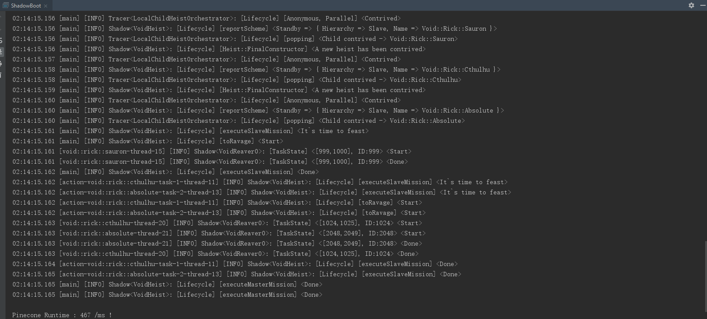
     
## 三、🔨 目录结构说明
- TODO 

## 四、🔬 使用许可
- MIT (保留本许可后，可随意分发、修改，欢迎参与贡献)

## 五、📚 参考文献
(参考文献包括Nuts家族 C/C++、Java等子语言运行支持库、本项目框架、本项目等所有涉及的子项目的总参考文献、源码、设计、
专利等相关资料。便于读者了解相关技术（设计）的源头和底层方法论，作者向相关参考项目（以及未直接列出项目）作者表示崇高敬意和感谢。)
01. C/C++ STL (容器、运行支持库设计，算法、设计模式和数据结构)
02. Java JDK  (容器、运行支持库设计，算法、设计模式和数据结构)
03. Go SDK  (容器、运行支持库设计，算法、设计模式和数据结构)
04. PHP 5.6 Source (解释器、相关支持库设计)
05. MySQL Source (参考多个设计思想和部分思想实现)
06. Linux Kernel (参考多个设计思想和部分思想实现)
07. Win95 Kernel (Reveal Edition)，Win32Apis，Runtime framework
08. WinNT 窗口事件思想、回调函数注入等
09. C/C++ Boost
10. C/C++ ACL -- One advanced C/C++ library for Unix/Windows.
11. Java Springframework Family (How IOC/AOP/etc works)
12. Hadoop MapReduce (How it works)
13. Python TensorFlow (Graph, how it orchestras)
14. Javascript DOM 设计、CSS选择器等
15. 其他若干个小框架、工具库、语言等（如Apache Commons、org.json、fastcgi、fastjson、libevent等），本文表示崇高敬意和感谢。


# 📈 项目活跃表

