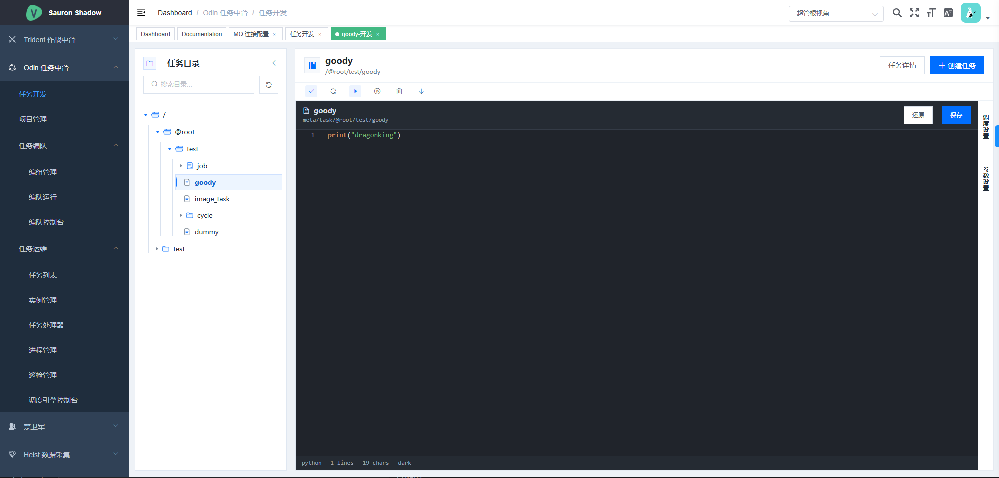
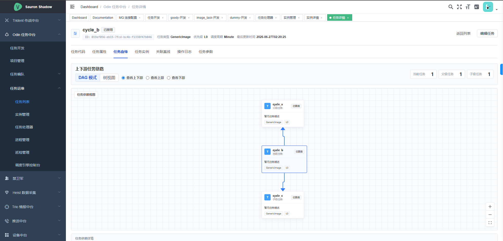
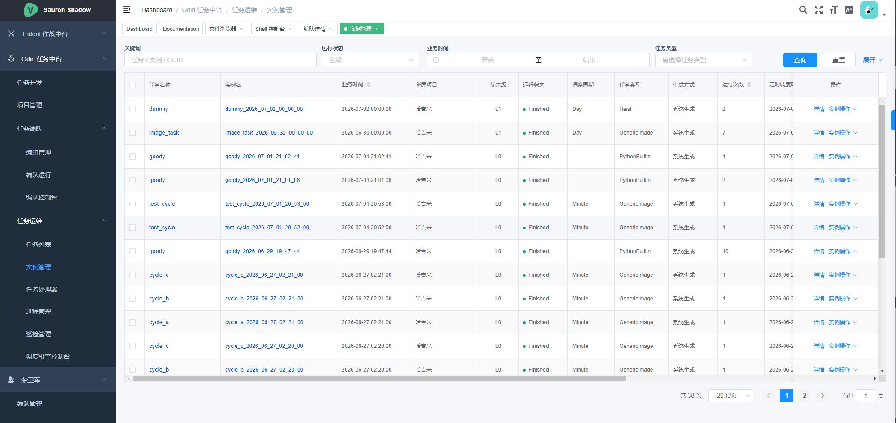
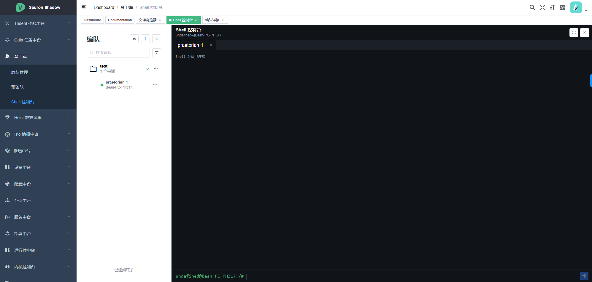
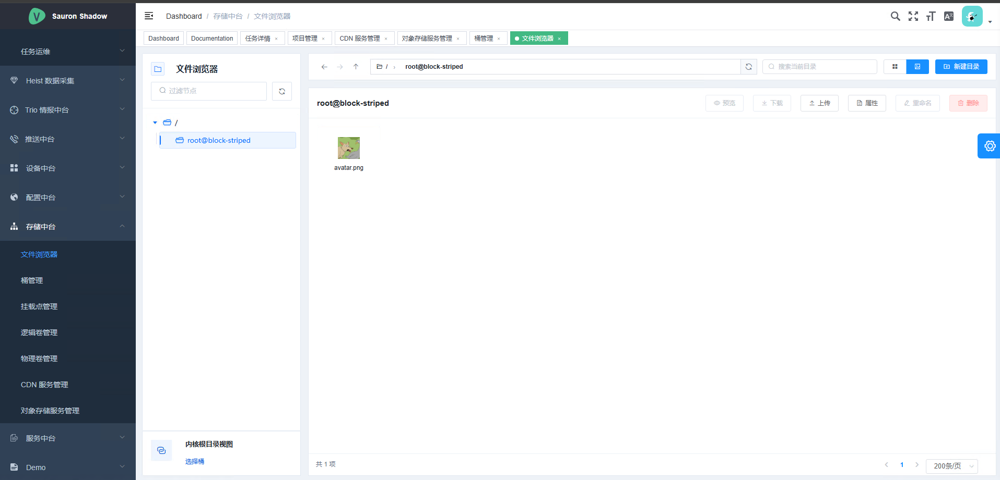
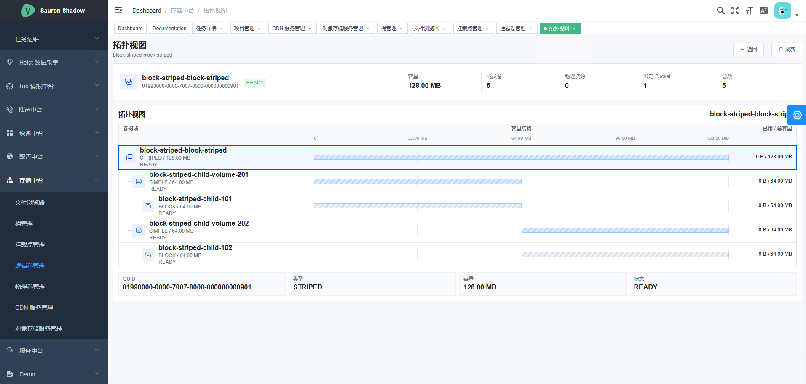
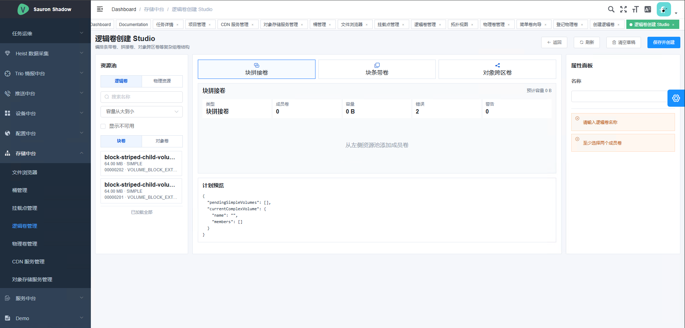
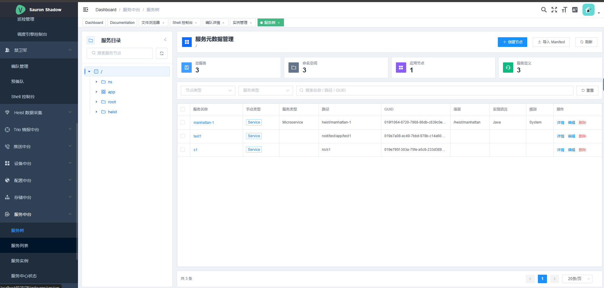
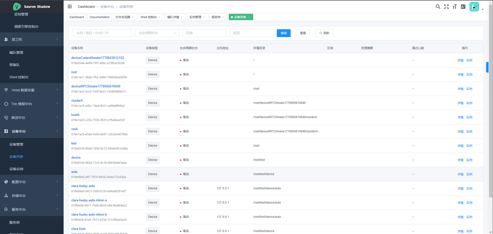

# Bean Nuts Hazelnut Hydra <br> 九头龙，分布式操作系统
<p align="center">
  <strong>
  真超级个体, 一个人公司, 一个人集团, 一个人中台, 大规模AI、数据、任务调度工业架构, 大规模控制, 
  中央情报系统, 大规模分布式爬虫, 大数据处理, 数据仓库, 云计算, 中台
   </strong>
</p>

<p align="center">
  <a href="https://docs.nutsky.com/docs/hazelnut_sauron_zh_cn">
    
  </a>

   <a href="https://github.com/DragonKingpin/Hydra/blob/beta/CHANGELOG.md" >
    
  </a>

   <a target="_blank" href="https://www.oracle.com/technetwork/java/javase/downloads/index.html" >
        
    </a>
   <a target="_blank" href='https://github.com/DragonKingpin/Hydra'>
        
   </a>

   <a target="_blank" href=''>
        
   </a>
</p>

<p align='center'>
  <b>简体中文</b> | <b>English[TODO]</b> | <a href="https://www.nutsky.com">Nuts Projects</a> | 
  <a href="https://www.dragonking.cn" target="_blank">Dragon King</a> | <a href="https://www.wkwja.cn" target="_blank">Ken 老板</a> 
  | <a href="https://www.geniusay.com" target="_blank">Genius 老板</a> | <a href="https://www.welsir.com" target="_blank">Welsir 老板</a> 
</p>

<p align='center'>
  文档（持续增量更新）:
  <a href="https://docs.nutsky.com/docs/hazelnut_sauron_zh_cn" target="_blank">https://docs.nutsky.com/docs/hazelnut_sauron_zh_cn</a> |
  真实集群搭建过程:
    <a href="https://zhuanlan.zhihu.com/p/634851956" target="_blank">https://zhuanlan.zhihu.com/p/634851956</a>
</p>

## 📖 Abstract
Would you like to own the "God Eyes"? Do you crave power? Do you wish to wield all information at your fingertips? 
**Now, data is all you need!**

The Hazelnut and Hydra ecosystem is a powerful data analysis "Elder Brain" designed specifically for "TJ" individuals, 'all information all I need'.
**Hey, commander!** We build a unique personal PB level data warehouse, knowledge base, and search engine just for you, your exclusive "God Eyes" !

Your own C4ISR, your own 'global' strike system, Central Intelligence System, Central Staff System, and firepower industrial plants. 
The underlying architecture of above.

## 📖 摘要 / 简介
**你想拥有‘上帝之眼’吗？你渴望力量吗？你希望一切信息尽在掌控吗？这个时代，数据即使世界！**

Hydra 生态，专为"TJ"人打造的大规模数据分析“主脑”，一切尽在掌握之中。
Hydra为你打造个人PB级数仓、知识库、图库、任务编排和服务于 Agent 工厂化的超级个体引擎，你的专属'上帝之眼'，为所欲为！

到底这是什么玩意？属于你自己的C4ISR，你自己的“全球”打击系统、中央情报系统、中央参谋系统和火力军工厂的底层战略架构。

### 字多不看？太高端听不懂？几个场景助你快速了解Hydra理念。
- **大规模知识库**：构造你的私人知识库，关联任何你感兴趣的知识图谱（金融、新闻、学术、游戏、音乐、电影、视频、小说、美食等），生成巨型知识库和图谱，并交给GPT等大模型给你生成属于你的`上帝报告`。
- **数据仓库**：海量数据，任你处置，你可以打造自己的数据`全图挂`，甚至可以乘坐时光机，在数据世界中随意穿行。你就是上帝，历史的变迁，触手可及。
- **数据集市**：打造你的个人GPT，随着算力平民化、大模型技术的平民化。未来，你不想拥有自己的GPT吗？你只需要不断收集属于你的数据集，未来打造你的专属GPT、Diffusion等。
- **大型采集**：统一并行架构打造大规模战略采集系统，多个实例助你快速入门：
1).维基百科全站爬取；2).Urban Dictionary全站爬取；3).imdb爬取；4).编年史子项目，每日全世界新闻采集，打造互联网记忆库与情报系统；
5).金融数据大规模采集（面向资金流向建模）；6).IP反查、ISP追踪、DNS/rDNS、域名、NIC等搜索引擎基架数据采集；等。（避免争议，不提供任何有争议的代码和数据）
- **数据平台**：面向战略和战术数据分析系统，构建和打通其他开源数据产品，面向智能ETL、数仓、取数、情报等专业大数据分析系统。
- **中台架构**：面向系统性实现上层应用、面向抽象、统一化，支撑大规模并行、大数据架构，信息、控制、调度、审计、权限等元架构分离。

### 🏆 3A史诗巨献 ⚔
全域覆盖、听你指挥、能打胜战、作风优良。

### 什么是 Hydra，他能干嘛？
- Hydra 由 <a href="https://www.dragonking.cn" target="_blank">DragonKing</a> 及其团队原创的分布式基架系统，
面向系统性构建上层大型应用。Hydra的设计基础首先是面向控制的，用于实现大规模控制，进而实现通用任务、操作系统。
- 说人话：**让一个人拥有真正一个集团能力的超级装备。**
一个人手握一个中台，控制一整个集群，你可以工业化地实现代码、情报、图片等流水线采集、分析、生产等，更多小秘密等亲发现。
- 再说人话：**让你像操作自己电脑一样，操作整个集群。**


## ！！！大的要来了！！！

## 一、📝 描述
### 1.1、瞟一眼功能



















### 1.2、框架组成
#### 全局中央架构鸟瞰图（抽象全局架构）


#### 全局架构鸟瞰图


1. 全局一致性，全系统范式统一，整整齐齐。
2. 分布式任务调度、分布式进程、大规模任务并发，应有尽有。
3. 分布式服务中心、设备中心、生命周期管理，应有尽有。
4. 分布式存储系统，S3 对象存储服务、卷系统、分布式桶，应有尽有。
5. 分布式远程控制体系、Shell系统、运维、部署系统，应有尽有。
6. 分布式消息、情报大规模控制、广播，应有尽有。


## 二、🧬 编译、使用
### 编译
- 项目使用Maven管理，使用jdk11以上版本即可运行。
- 编译得到jar包，即插即用，随意部署。
- 或使用 IntelliJ IDEA 直接打开即可。

### 最小系统使用
- 无需特意配置环境变量等信息。
- 系统配置文件，默认位于"./system/setup/.."
```json5
    "Orchestration"         : {
      "Name": "ServgramOrchestrator",
      "Type": "Parallel", // Enum: { Sequential, Parallel, Loop }

      // Servgram-Classes scanning package-scopes
      "ServgramScopes": [
        "com.sauron.heist.heistron"
      ],

      "Transactions": [
        { "Name": "Heist", "Type": "Sequential", "Primary": true }
      ]
    }
```
- 默认启动 `Heist` （爬虫）任务
- 检查 `Heist` 小程序配置，默认位于"./system/setup/heist.json5"
```json5
    "Orchestration"    : {
        "Name": "HeistronOrchestrator",
        "Type": "Parallel", // Enum: { Sequential, Parallel, Loop }
    
        "DirectlyLoad" : {
          "Prefix": [],
          "Suffix": [ "Heist" ]
        },
    
        "ServgramScopes": [
          "com.sauron.shadow.heists",
          "com.sauron.shadow.chronicle"
        ],
    
        // 修改这里，可运行例程 'Void' , 最小系统演示
        "Transactions": [
          { "Name": "Void", "Type": "Sequential" /* Enum: { Sequential, Parallel, SequentialActions, ParallelActions, LoopActions }*/ },
        ]
    }
```
- 检查 `Void` 小小程序配置，默认位于"./system/setup/heists/Void.json5"，原则上注意大小写
```json5
    "Orchestration"         : {
        "Name": "VoidOrchestrator",
        "Type": "Parallel", // Enum: { Sequential, Parallel, Loop }
    
        "Transactions": [
          { "Name": "Jesus", "Type": "Sequential"  },
          { "Name": "Satan", "Type": "Sequential"  },
          { "Name": "Rick" , "Type": "Sequential"  }
        ]
    }
```
- 正常启动，将开始本地流水线序列调度 "Jesus"、"Satan"、"Rick"三个大任务和其子任务。

     
     
## 三、🔨 目录结构说明
- TODO 

## 四、🔬 使用许可
- MIT (保留本许可后，可随意分发、修改，欢迎参与贡献)

## 五、📚 参考文献
(参考文献包括Nuts家族 C/C++、Java等子语言运行支持库、本项目框架、本项目等所有涉及的子项目的总参考文献、源码、设计、
专利等相关资料。便于读者了解相关技术（设计）的源头和底层方法论，作者向相关参考项目（以及未直接列出项目）作者表示崇高敬意和感谢。)
01. C/C++ STL (容器、运行支持库设计，算法、设计模式和数据结构)
02. Java JDK  (容器、运行支持库设计，算法、设计模式和数据结构)
03. Go SDK  (容器、运行支持库设计，算法、设计模式和数据结构)
04. PHP 5.6 Source (解释器、相关支持库设计)
05. MySQL Source (参考多个设计思想和部分思想实现)
06. Linux Kernel (参考多个设计思想和部分思想实现)
07. Win95 Kernel (Reveal Edition)，Win32Apis，Runtime framework
08. WinNT 窗口事件思想、回调函数注入等
09. C/C++ Boost
10. C/C++ ACL -- One advanced C/C++ library for Unix/Windows.
11. Java Springframework Family (How IOC/AOP/etc works)
12. Hadoop MapReduce (How it works)
13. Python TensorFlow (Graph, how it orchestras)
14. Javascript DOM 设计、CSS选择器等
15. 其他若干个小框架、工具库、语言等（如Apache Commons、org.json、fastcgi、fastjson、libevent等），本文表示崇高敬意和感谢。


# 📈 项目活跃表

